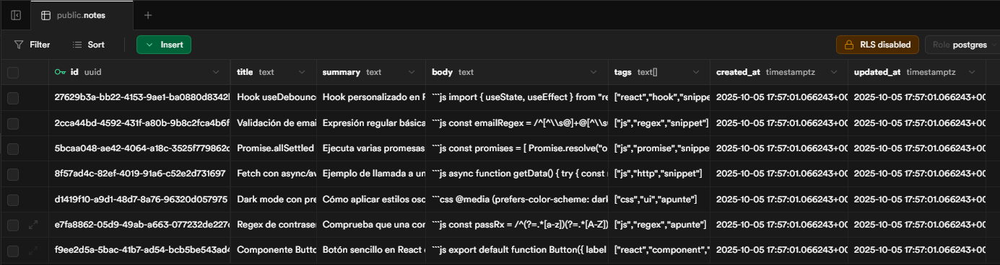
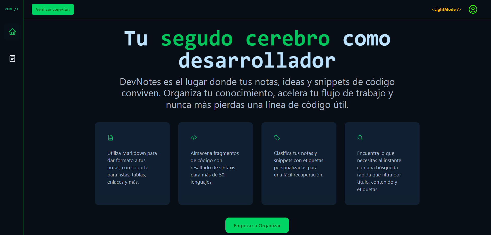
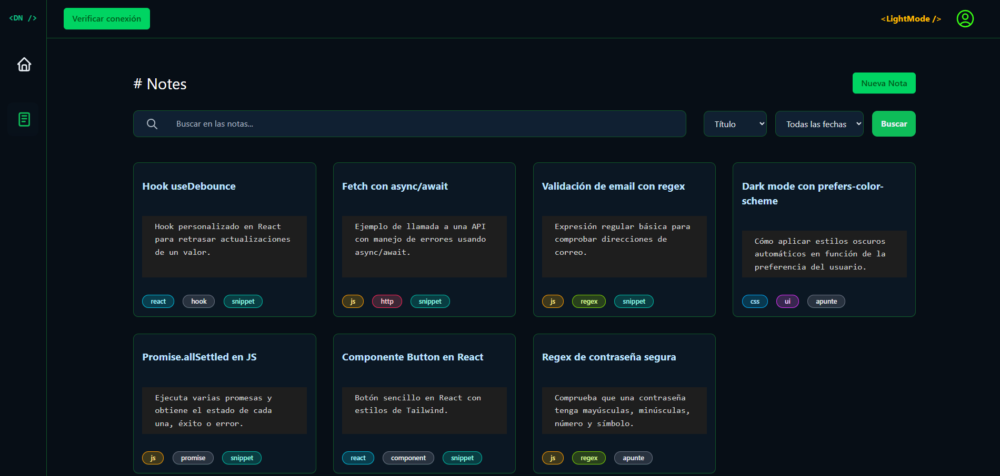
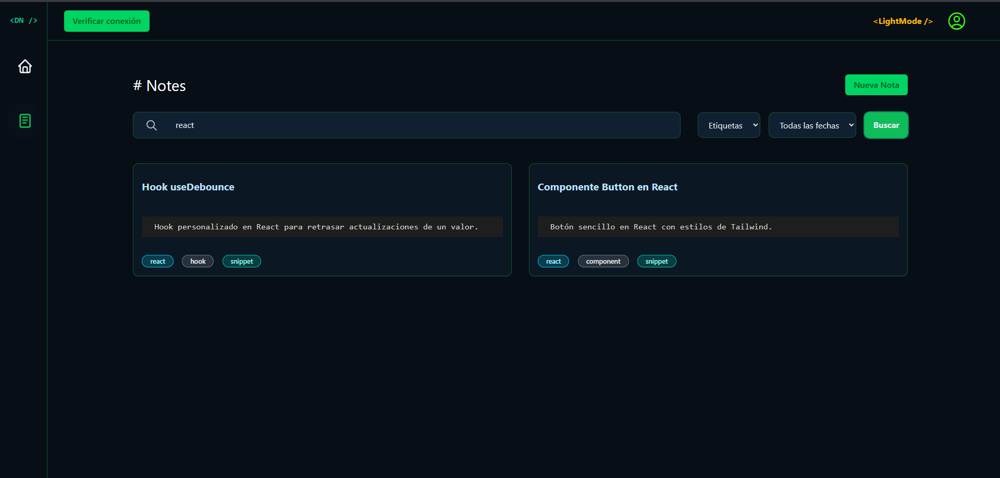
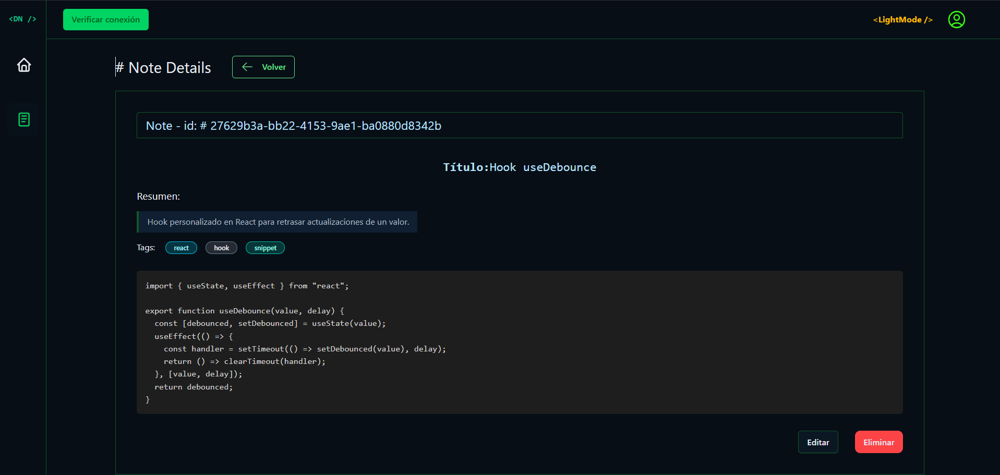

<p align="center">
  
</p>

[🌐 Ver Demo](https://github.com/FelixRodriguezG/CodeNotes.git) &nbsp;|&nbsp; [🐞 Reportar Bug](https://github.com/FelixRodriguezG/CodeNotes/issues) &nbsp;|&nbsp; [✨ Solicitar Feature](https://github.com/FelixRodriguezG/CodeNotes/issues)

## 📋 Descripción

CodeNotes es una aplicación web para desarrolladores que permite organizar y gestionar notas técnicas, snippets de código y documentación de manera eficiente. Con un potente sistema de búsqueda, etiquetado y organización, CodeNotes se convierte en tu segundo cerebro para almacenar conocimiento técnico.## 🚀 Stack Tecnológico

### Frontend

- React 18 + Vite 4
- TailwindCSS 3
- React Router 6
- Context API para gestión de estado
- JavaScript (ES6+)

### Backend

- Supabase (PostgreSQL)
- Row Level Security (RLS)
- Generación automática de timestamps

## 💾 Modelo de Datos

### Estructura de la Tabla en Supabase

<div align="center">
  
</div>

```javascript
{
  // Campos autogenerados por Supabase
  id: UUID,           // Primary Key
  created_at: Date,   // Timestamp con zona horaria
  updated_at: Date,   // Actualización automática

  // Campos de la nota
  title: String,      // requerido
  summary: String,    // requerido
  body: String,       // requerido
  tags: Array        // array de tags
}
```

### Edge Function para Verificar Conexión

La siguiente Edge Function de Supabase (Deno) verifica la conexión con la base de datos:

```typescript
// /supabase/functions/check-connection/index.ts

Deno.serve(async (req) => {
  const origin = req.headers.get("origin") ?? "*";
  const headers = {
    "Content-Type": "application/json",
    "Access-Control-Allow-Origin": origin,
    "Access-Control-Allow-Methods": "GET,OPTIONS",
    "Access-Control-Allow-Headers":
      "authorization, x-client-info, content-type",
    "Cache-Control": "no-store",
  };

  // Manejar preflight OPTIONS
  if (req.method === "OPTIONS") {
    return new Response(null, { headers, status: 204 });
  }

  // Solo permitir GET
  if (req.method !== "GET") {
    return new Response(
      JSON.stringify({
        status: "error",
        message: "Method not allowed",
      }),
      { headers, status: 405 }
    );
  }

  // Verificar variables de entorno
  const SUPABASE_URL = Deno.env.get("SUPABASE_URL") ?? "";
  const SUPABASE_ANON_KEY = Deno.env.get("SUPABASE_ANON_KEY") ?? "";

  if (!SUPABASE_URL || !SUPABASE_ANON_KEY) {
    return new Response(
      JSON.stringify({
        status: "error",
        message: "Missing env vars",
      }),
      { headers, status: 500 }
    );
  }

  // Comprobar conexión a Supabase
  const healthUrl = SUPABASE_URL.replace(/\/+$/, "") + "/rest/v1/";
  let reachable = false;

  try {
    const r = await fetch(healthUrl, {
      method: "HEAD",
      headers: { apikey: SUPABASE_ANON_KEY },
    });
    reachable = [200, 204, 403, 404].includes(r.status);
  } catch {
    reachable = false;
  }

  return new Response(
    JSON.stringify({
      status: reachable ? "ok" : "unreachable",
    }),
    { headers, status: reachable ? 200 : 502 }
  );
});
```

Para usar esta función:

1. Despliega la función en Supabase:

```bash
supabase functions deploy check-connection
```

2. Llama a la función desde el frontend:

```javascript
const checkConnection = async () => {
  const { data, error } = await supabase.functions.invoke("check-connection");
  if (data?.status === "ok") {
    console.log("Conexión exitosa");
  }
};
```

Respuestas posibles:

- `200 OK`: `{ "status": "ok" }`
- `502 Bad Gateway`: `{ "status": "unreachable" }`
- `405 Method Not Allowed`: Si no es GET
- `500 Internal Error`: Si faltan variables de entorno

## ✨ Características

- 🔍 Búsqueda por título, resumen y tags
- 📝 Editor con soporte Markdown
- 🏷️ Sistema de tags con colores por tecnología
- 🌗 Tema claro/oscuro
- 📱 Diseño responsive

### Vista Previa

<div align="center">
  <details>
    <summary>📸 Ver todas las capturas</summary>

### 🏠 Página de Inicio

  
  
  ### 📝 Todas las Notas
  
  
  ### 🔍 Notas Filtradas
  
  
  ### 📋 Detalle de Nota
  
  
  </details>
</div>

### Características Principales

<div align="center">
  <table>
    <tr>
      <td align="center" width="50%">
        <p><strong>🏠 Vista Principal</strong></p>
        
      </td>
      <td align="center" width="50%">
        <p><strong>📝 Gestión de Notas</strong></p>
        
      </td>
    </tr>
    <tr>
      <td align="center">
        <p><strong>🔍 Búsqueda Avanzada</strong></p>
        
      </td>
      <td align="center">
        <p><strong>� Vista Detallada</strong></p>
        
      </td>
    </tr>
  </table>
</div>
- ♿ Accesibilidad (ARIA, navegación por teclado)
- ⚡ Timestamps automáticos
- 🔒 Seguridad con RLS

## 🛠️ Instalación

1. Clonar el repositorio

```bash
git clone https://github.com/FelixRodriguezG/CodeNotes.git
cd CodeNotes
```

2. Instalar dependencias

```bash
npm install
```

3. Configurar variables de entorno

```bash
cp .env.example .env
```

4. Actualizar `.env` con tus credenciales de Supabase

```
VITE_SUPABASE_URL=<tu-url>
VITE_SUPABASE_ANON_KEY=<tu-key>
```

5. Configurar la base de datos

   - Sigue las instrucciones en `db/README.md`
   - O ejecuta directamente el script en `db/setup.sql` en el SQL Editor de Supabase

6. Iniciar entorno de desarrollo

```bash
npm run dev
```

## 📁 Estructura del Proyecto

```
db/               # Configuración de base de datos
  ├── setup.sql   # Script de inicialización
  └── README.md   # Instrucciones detalladas
src/
  ├── api/        # Cliente Supabase
  │   └── supabaseClient.js
  ├── components/ # Componentes React
  │   ├── Button.jsx
  │   ├── Card.jsx
  │   ├── Modal.jsx
  │   └── ...
  ├── context/   # Contextos
  │   ├── NotesContext.jsx
  │   └── ThemeContext.jsx
  ├── hooks/     # Hooks personalizados
  ├── layout/    # Componentes layout
  ├── pages/     # Páginas/rutas
  ├── router/    # Configuración router
  └── styles/    # Estilos CSS/Tailwind
      ├── components/
      └── theme.css
```

## 📜 Scripts Disponibles

- `npm run dev`: Inicia entorno de desarrollo (http://localhost:5173)
- `npm run build`: Genera build de producción
- `npm run lint`: Ejecuta ESLint
- `npm run preview`: Vista previa de build

## 🤝 Contribuir

1. Fork del [repositorio](https://github.com/FelixRodriguezG/CodeNotes.git)
2. Crear rama feature

```bash
git checkout -b feature/nueva-funcionalidad
```

3. Commit cambios

```bash
git commit -am 'feat: añade nueva funcionalidad'
```

4. Push a la rama

```bash
git push origin feature/nueva-funcionalidad
```

5. Crear Pull Request

## 📝 Licencia

Este proyecto está bajo la Licencia MIT - ver el archivo [LICENSE](LICENSE) para más detalles.

## 🔗 Enlaces

- [Repositorio](https://github.com/FelixRodriguezG/CodeNotes.git)
- [Reportar Bug](https://github.com/FelixRodriguezG/CodeNotes/issues)
- [Solicitar Feature](https://github.com/FelixRodriguezG/CodeNotes/issues)

## 👥 Autores

- Felix Rodriguez - [GitHub](https://github.com/FelixRodriguezG)


