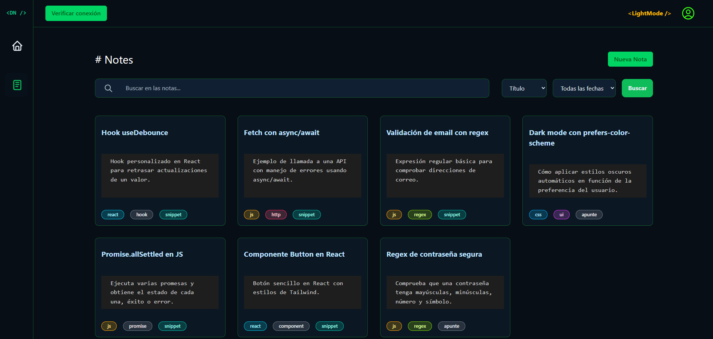
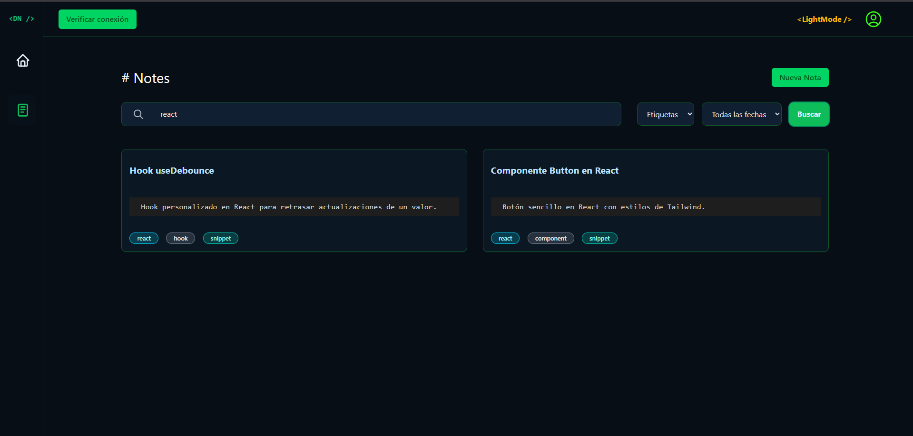

# CodeNotes

<p align="center">
  
</p>

<div align="center">

[](https://github.com/FelixRodriguezG/CodeNotes/issues)
[](LICENSE)
[](https://reactjs.org/)
[](https://vitejs.dev/)
[](https://supabase.com/)

Tu segundo cerebro como desarrollador. Organiza tus notas, ideas y snippets de código en un solo lugar.

[Ver Demo](https://github.com/FelixRodriguezG/CodeNotes.git) · 
[Reportar Bug](https://github.com/FelixRodriguezG/CodeNotes/issues) · 
[Solicitar Feature](https://github.com/FelixRodriguezG/CodeNotes/issues)

</div>

## 📑 Índice

- [Sobre el Proyecto](#-sobre-el-proyecto)
  - [Características](#-características)
  - [Capturas de Pantalla](#-capturas-de-pantalla)
  - [Stack Tecnológico](#-stack-tecnológico)
- [Empezando](#-empezando)
  - [Prerrequisitos](#prerrequisitos)
  - [Instalación](#instalación)
  - [Configuración de Base de Datos](#configuración-de-base-de-datos)
- [Uso](#-uso)
  - [Estructura del Proyecto](#estructura-del-proyecto)
  - [Scripts Disponibles](#scripts-disponibles)
- [API](#-api)
  - [Modelo de Datos](#modelo-de-datos)
  - [Edge Functions](#edge-functions)
- [Contribuir](#-contribuir)
- [Licencia](#-licencia)
- [Contacto](#-contacto)

## 🚀 Sobre el Proyecto

CodeNotes es una aplicación web para desarrolladores que permite organizar y gestionar notas técnicas, snippets de código y documentación de manera eficiente. Con un potente sistema de búsqueda, etiquetado y organización, CodeNotes se convierte en tu segundo cerebro para almacenar conocimiento técnico.

### ✨ Características

- 🔍 Búsqueda por título, resumen y tags
- 📝 Editor con soporte Markdown
- 🏷️ Sistema de tags con colores por tecnología
- 🌗 Tema claro/oscuro
- 📱 Diseño responsive
- ♿ Accesibilidad (ARIA, navegación por teclado)
- ⚡ Timestamps automáticos
- 🔒 Seguridad con RLS

### 📸 Capturas de Pantalla

<div align="center">
  <details>
    <summary>🖼️ Ver todas las capturas</summary>

  ### 🏠 Página de Inicio
  
  
  ### 📝 Todas las Notas
  
  
  ### 🔍 Notas Filtradas
  
  
  ### 📋 Detalle de Nota
  
  
  </details>
</div>

### 🛠️ Stack Tecnológico

#### Frontend
- React 18 + Vite 4
- TailwindCSS 3
- React Router 6
- Context API
- JavaScript (ES6+)

#### Backend
- Supabase (PostgreSQL)
- Row Level Security (RLS)
- Edge Functions (Deno)
- Generación automática de timestamps

## 🏁 Empezando

### Prerrequisitos

- Node.js >= 18.x
- npm >= 9.x
- Cuenta en [Supabase](https://supabase.com)

### Instalación

1. Clonar el repositorio
```bash
git clone https://github.com/FelixRodriguezG/CodeNotes.git
cd CodeNotes
```

2. Instalar dependencias
```bash
npm install
```

3. Configurar variables de entorno
```bash
cp .env.example .env
```

4. Actualizar `.env` con tus credenciales
```
VITE_SUPABASE_URL=<tu-url>
VITE_SUPABASE_ANON_KEY=<tu-key>
```

5. Iniciar entorno de desarrollo
```bash
npm run dev
```

### Configuración de Base de Datos

La estructura de la base de datos está en `db/setup.sql`. Incluye:
- Tabla `notes`
- Triggers para `updated_at`
- Datos de ejemplo

<details>
<summary>Ver estructura de la tabla</summary>
<div align="center">
  
</div>
</details>

## 💻 Uso

### Estructura del Proyecto

```
db/               # Configuración de base de datos
  ├── setup.sql   # Script de inicialización
  └── README.md   # Instrucciones detalladas
src/
  ├── api/        # Cliente Supabase
  ├── components/ # Componentes React
  ├── context/    # Contextos (tema, notas)
  ├── hooks/      # Hooks personalizados
  ├── layout/     # Componentes layout
  ├── pages/      # Páginas/rutas
  ├── router/     # Configuración router
  └── styles/     # Estilos CSS/Tailwind
```

### Scripts Disponibles

- `npm run dev`: Desarrollo (http://localhost:5173)
- `npm run build`: Build de producción
- `npm run lint`: Ejecuta ESLint
- `npm run preview`: Preview del build

## 📡 API

### Modelo de Datos

```javascript
{
  id: UUID,           // Primary Key
  title: String,      // requerido
  summary: String,    // requerido
  body: String,       // requerido
  tags: Array,        // array de tags
  created_at: Date,   // auto-generado
  updated_at: Date    // auto-actualizado
}
```

### Edge Functions

La función de verificación de conexión está disponible en `/supabase/functions/check-connection/index.ts`.

<details>
<summary>Ver código de la Edge Function</summary>

```typescript
Deno.serve(async (req) => {
  // ... [código previo de la Edge Function] ...
});
```

Respuestas:
- `200 OK`: `{ "status": "ok" }`
- `502 Bad Gateway`: `{ "status": "unreachable" }`
- `405 Method Not Allowed`: Si no es GET
- `500 Internal Error`: Si faltan variables de entorno
</details>

## 🤝 Contribuir

1. Fork del repositorio
2. Crear rama feature
```bash
git checkout -b feature/nueva-funcionalidad
```
3. Commit cambios
```bash
git commit -am 'feat: nueva funcionalidad'
```
4. Push a la rama
```bash
git push origin feature/nueva-funcionalidad
```
5. Crear Pull Request

## 📄 Licencia

Este proyecto está bajo la Licencia MIT - ver el archivo [LICENSE](LICENSE) para más detalles.

## 📧 Contacto

Felix Rodriguez - [@GitHub](https://github.com/FelixRodriguezG)

Link del Proyecto: [https://github.com/FelixRodriguezG/CodeNotes](https://github.com/FelixRodriguezG/CodeNotes)

---

⌨️ con ❤️ por [Felix Rodriguez](https://github.com/FelixRodriguezG)